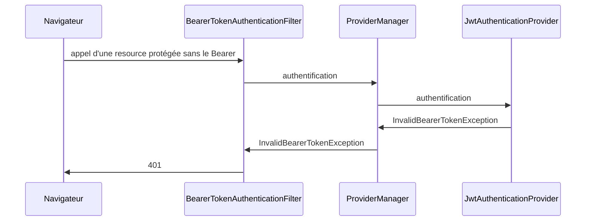
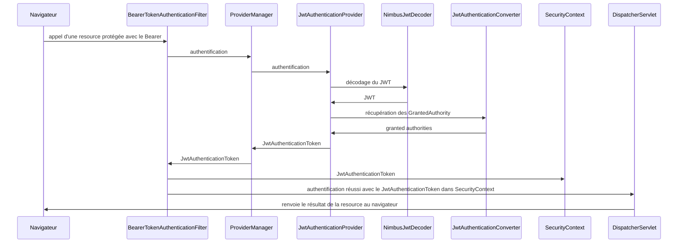
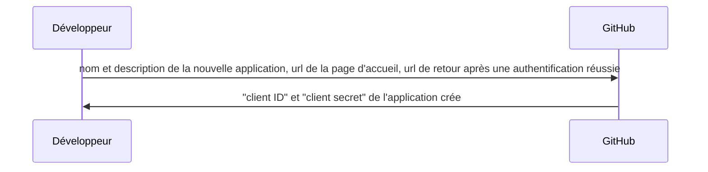
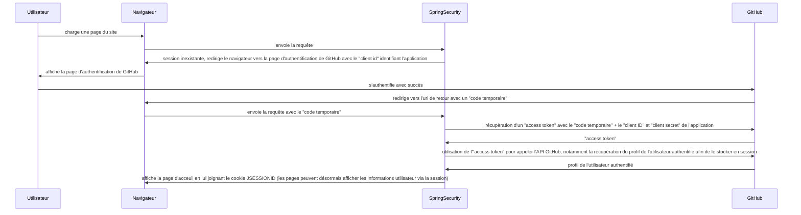

# Exemple d'API combinant Spring Boot Web et Kotlin
- spring-boot-starter-parent 3.4.1
  - spring-boot-starter-web
  - spring-boot-starter-validation (annotations correspondant aux contraintes pour la validation des données)
  - spring-boot-starter-test
  - spring-boot-starter-security (spring-security-config 6.4.2 et spring-security-web 6.4.2)
    - spring-security-oauth2-resource-server 6.4.2 (APIs via OAuth 2.0 Bearer Tokens)
    - spring-security-oauth2-jose 6.4.2 (Javascript Object Signing and Encryption : JSON Web Token, JSON Web Signature, JSON Web Encryption, JSON Web Key)
- springdoc-openapi-starter-webmvc-ui 2.8.5
- kotlin 2.1.0
  - kotlin-stdlib
  - kotlin-reflect
  - kotlin-test-junit5
- kotlin-logging-jvm 3.0.5
- dépendance JPA
- mysql 8.0.36 + H2 2.3.232 (tests)

# Spring Security : OAuth 2.0 Resource Server JWT
[OAuth 2.0 Resource Server JWT](https://docs.spring.io/spring-security/reference/servlet/oauth2/resource-server/jwt.html)

## Appel sans le Bearer

## Appel avec le Bearer dans le header Authorization

# Spring Security : authentification OAuth2 avec GitHub
[Spring Boot : OAuth avec GitHub](https://spring.io/guides/tutorials/spring-boot-oauth2)

[GitHub : OAuth](https://docs.github.com/en/apps/oauth-apps/building-oauth-apps/authorizing-oauth-apps)

## Enregistrement de la nouvelle application OAuth sur GitHub
[Enregistrement d'une application sur GitHub](https://github.com/settings/applications/new)

## Scénario d'authentification auprès de GitHub par Spring Security

