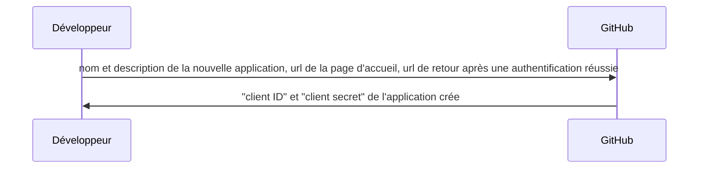
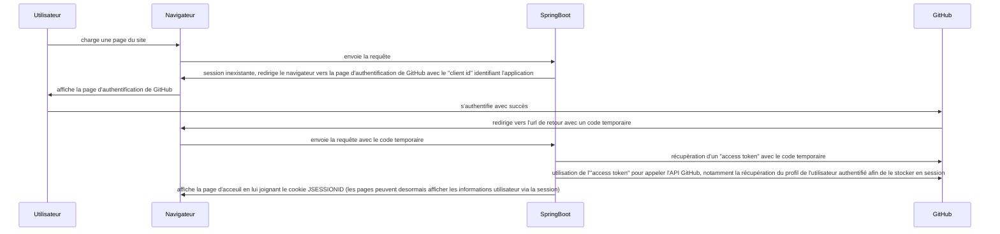

# Exemple d'API combinant Spring Boot Web et Kotlin
- spring-boot-starter-parent 3.4.1 (spring-boot-starter-web et spring-boot-starter-test)
- kotlin 2.1.0 (kotlin-stdlib, kotlin-reflect, kotlin-test-junit5 et kotlin-logging-jvm)
- dépendance JPA
- mysql 8.0.36 + H2 2.3.232 (tests)

# Spring Boot : authentification OAuth2 avec GitHub
[Spring Boot : OAuth avec GitHub](https://spring.io/guides/tutorials/spring-boot-oauth2)

[GitHub : OAuth](https://docs.github.com/en/apps/oauth-apps/building-oauth-apps/authorizing-oauth-apps)

## Enregistrement de la nouvelle application OAuth sur GitHub
[Enregistrement d'une application sur GitHub](https://github.com/settings/applications/new)

```mermaid
  sequenceDiagram
    Développeur->>GitHub: nom et description de la nouvelle application, url de la page d'accueil, url de retour après une authentification réussie
    GitHub->>Développeur: "client ID" et "client secret" de l'application crée
```

## Scénario d'authentification auprès de GitHub par SpringBoot

```mermaid
  sequenceDiagram
    Utilisateur->>Navigateur: charge une page du site
    Navigateur->>SpringBoot: envoie la requête
    SpringBoot->>Navigateur: session inexistante, redirige le navigateur vers la page d'authentification de GitHub avec le "client id" identifiant l'application
    Navigateur->>Utilisateur: affiche la page d'authentification de GitHub
    Utilisateur->>GitHub: s'authentifie avec succès
    GitHub->>Navigateur: redirige vers l'url de retour avec un code temporaire
    Navigateur->>SpringBoot: envoie la requête avec le code temporaire
    SpringBoot->>GitHub: récupèration d'un "access token" avec le code temporaire
    SpringBoot->>GitHub: utilisation de l'"access token" pour appeler l'API GitHub, notamment la récupération du profil de l'utilisateur authentifié afin de le stocker en session
    SpringBoot->>Navigateur: affiche la page d'acceuil en lui joignant le cookie JSESSIONID (les pages peuvent desormais afficher les informations utilisateur via la session)
```